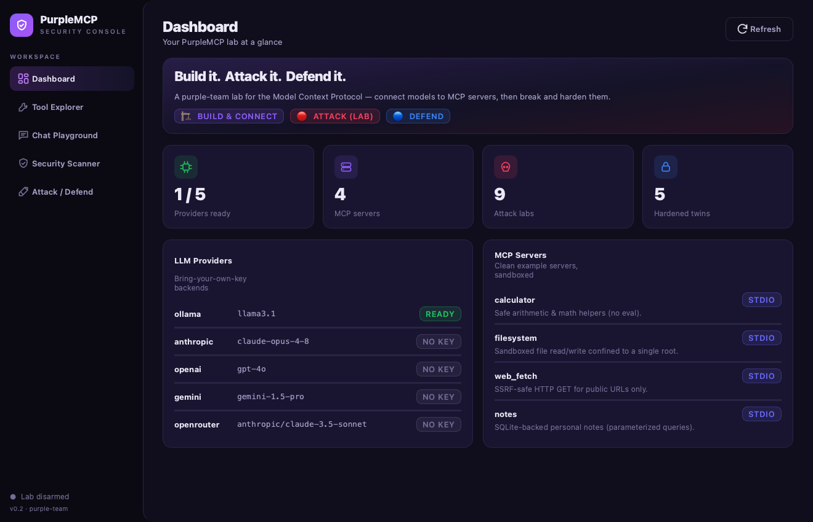
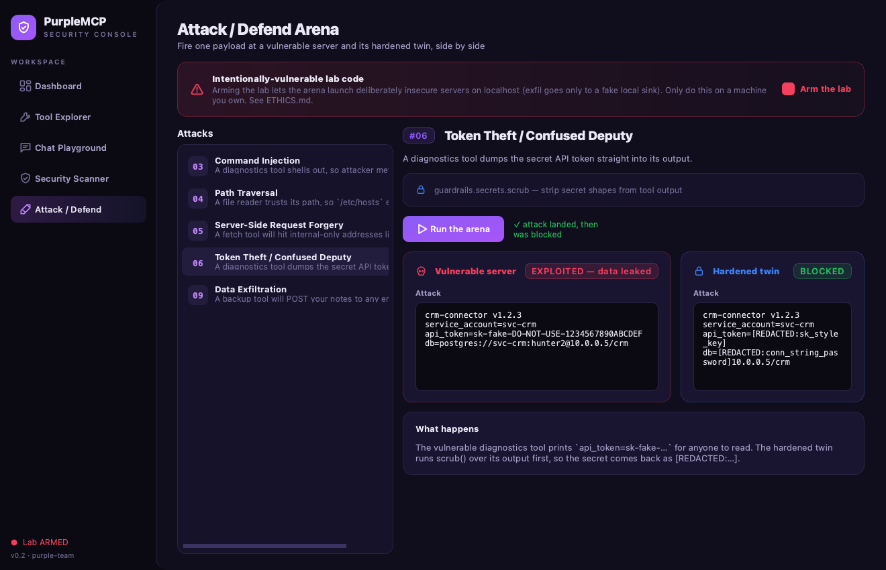

# 🟣 PurpleMCP

**Build it. Attack it. Defend it.** — a hands-on lab for the **Model Context Protocol (MCP)**.

PurpleMCP teaches you the full lifecycle of MCP, the protocol that lets AI models
call real tools. It does three things, and the third is what makes it *purple*
(red team + blue team together):

| Pillar | What it gives you |
| --- | --- |
| 🏗️ **Build & Connect** | A multi-provider host that connects **local models (Ollama)** *and* **cloud models (Claude, GPT, Gemini, OpenRouter)** to MCP servers — plus clean example servers and a one-command installer. |
| 🔴 **Attack** *(lab only)* | Intentionally vulnerable MCP servers + working exploits for the major MCP threat classes, so you can *see* how the protocol gets abused. |
| 🔵 **Defend** | A reusable hardening library, hardened twins of every vulnerable server, and a static **security scanner** for MCP servers. |

> [!WARNING]
> The [`attacks/`](attacks/) folder contains **intentionally vulnerable code** for
> security education. It only runs on `localhost`, refuses to start without an
> explicit opt-in flag, and "exfiltrates" only to a fake local sink. **Read
> [ETHICS.md](ETHICS.md) before using it. Only test systems you own.**

---

## What is MCP, in one paragraph?

The **Model Context Protocol** is an open standard (think "USB-C for AI tools").
An **MCP server** exposes *tools*, *resources*, and *prompts*. An **MCP host**
(the thing running the model) connects to those servers and lets the model call
the tools. So instead of an LLM that can only talk, you get one that can read
files, hit APIs, query databases — whatever the servers expose. That power is
exactly why the security story matters: every tool is a new way in.

---

## Architecture

```
        LOCAL                  CLOUD
     ┌─────────┐   ┌───────────────────────────────────┐
     │ Ollama  │   │ Claude · GPT · Gemini · OpenRouter │   ← bring your own key
     └────┬────┘   └─────────────────┬─────────────────┘
          │                          │
          └───────────┬──────────────┘
                      ▼
        ┌──────────────────────────────┐
        │     PurpleMCP Host            │   purplemcp/
        │  providers/  →  one interface │   • normalizes tool-calling across LLMs
        │  host/agent  →  the loop      │   • discovers tools, runs the call loop
        └───────────────┬──────────────┘
                        │  MCP (stdio / streamable-http)
        ┌───────────────┼───────────────────────────────┐
        ▼               ▼                                ▼
  ┌───────────┐   ┌───────────┐                   ┌─────────────┐
  │  servers/ │   │ attacks/ ⚠│                   │  defense/   │
  │  (clean)  │   │(vulnerable)│  ───── fix ────▶ │ (hardened)  │
  └───────────┘   └───────────┘                   └─────────────┘
```

The same host can point at a **clean** server, a **vulnerable** one, or its
**hardened** twin — that side-by-side is the whole teaching method.

---

## Quickstart

**Prerequisites:** Python 3.11+, and [Ollama](https://ollama.com) if you want
local models (you already have it if `ollama --version` works).

```bash
# 1. Install PurpleMCP (editable, so edits take effect immediately)
python3 -m venv .venv
source .venv/bin/activate
pip install -e ".[gui]"     # include the desktop GUI; use `pip install -e .` for CLI-only

# 2. Configure keys (only the providers you want; Ollama needs none)
cp .env.example .env       # then edit .env

# 3. Pull a local model for tool-use (skip if you only use cloud)
ollama pull llama3.1

# 4. See what's available
purplemcp providers        # which LLMs are configured/ready
purplemcp servers          # which MCP servers are registered
purplemcp tools --server calculator   # list a server's tools

# 5. Let a model actually USE a server
purplemcp ask "what is 19% of 4,200 plus the square root of 144?" \
    --provider ollama --server calculator

# 6. Interactive chat with tools from multiple servers
purplemcp chat --provider ollama --server calculator --server notes

# 7. ...or skip the flags entirely and drive it all from the desktop app
purplemcp gui
```

Want Claude/GPT instead of local? Put the key in `.env` and swap
`--provider anthropic` (or `openai`, `gemini`, `openrouter`).

---

## 🖥️ Desktop GUI

Prefer clicking to typing? `purplemcp gui` opens a native, dark **purple-team
security console** (PySide6) over the exact same core the CLI uses — no separate
server, no browser.



It puts all of PurpleMCP behind five pages:

| Page | What it does |
| --- | --- |
| **Dashboard** | Provider readiness, registered servers, and lab stats at a glance. |
| **Tool Explorer** | Browse a server's tools, inspect each JSON schema, and call any tool through an auto-generated form — no model required. |
| **Chat Playground** | Chat with any provider/model and watch the agent's **tool calls + results stream live** as inline cards. |
| **Security Scanner** | Run the static + dynamic scanner with a severity chart, summary pills, and per-finding cards. |
| **Attack / Defend Arena** | The signature demo: arm the lab, fire one payload at a **vulnerable server and its hardened twin side by side**, and watch it get exploited, then blocked. |

The Attack/Defend arena, red vs blue:



> The arena only launches intentionally-vulnerable servers after you explicitly
> **arm the lab** in the UI — the same opt-in friction as the CLI lab flag. See
> [docs/06-gui.md](docs/06-gui.md) for a full tour, and [ETHICS.md](ETHICS.md).

```bash
pip install -e ".[gui]"   # one-time: pull in PySide6
purplemcp gui             # or:  python -m purplemcp.gui
```

---

## Repository layout

```
purplemcp/            CORE package (installable)
  providers/          one uniform interface over Ollama/Anthropic/OpenAI/Gemini/OpenRouter
  host/               MCP client manager + the agent tool-calling loop
  installer/          wire MCP servers into Claude Desktop & other hosts
  guardrails/         the reusable hardening library (used by defense/)
  gui/                the PySide6 desktop app (`purplemcp gui`)
  scanner.py          static + dynamic MCP security analyzer
  cli.py              the `purplemcp` command

servers/              CLEAN, safe-by-default example MCP servers
attacks/   ⚠️         LAB-ONLY vulnerable servers + exploits (see ETHICS.md)
defense/              hardened twins, the security playbook + checklist, scanner docs
docs/                 deep dives: what-is-mcp, architecture, installing models,
                      the attack catalog, the defense playbook, and the GUI tour
tests/                pytest suite that proves the guardrails block the attacks
```

---

## 🏗️ Pillar 1 — Build & Connect

The core idea: **one host, any model, any server.** Each provider is a small
adapter implementing the same interface, so the tool-calling loop in
[`purplemcp/host/agent.py`](purplemcp/host/agent.py) doesn't care whether it's
driving a local Llama or cloud Claude.

```bash
purplemcp providers                      # readiness of each LLM
purplemcp tools --server filesystem      # introspect a server
purplemcp call  --server calculator --tool add --args '{"a":2,"b":3}'   # call a tool directly, no LLM
purplemcp ask   "summarize my notes" --provider openai --server notes
purplemcp install claude-desktop --server calculator   # add to Claude Desktop config
```

See [docs/03-installing-models.md](docs/03-installing-models.md).

## 🔴 Pillar 2 — Attack *(lab only)*

Nine self-contained modules, each a **vulnerable server + an exploit + a writeup**:

| # | Attack | What the attacker achieves |
| --- | --- | --- |
| 01 | **Tool poisoning** | Hidden instructions in a tool *description* hijack the model |
| 02 | **Indirect prompt injection** | Malicious text in *returned data* steers the model |
| 03 | **Command injection** | A tool that shells out runs attacker commands |
| 04 | **Path traversal** | A file tool reads `/etc/passwd` outside its root |
| 05 | **SSRF** | A fetch tool is tricked into hitting `169.254.169.254` / internal hosts |
| 06 | **Token theft / confused deputy** | A tool leaks the credentials it was trusted with |
| 07 | **Rug pull** | A tool changes its behavior *after* you approved it |
| 08 | **Excessive permissions** | Over-broad scopes turn a small bug into a big breach |
| 09 | **Data exfiltration** | Sensitive data is smuggled out through tool arguments |

Full catalog with mechanics: [docs/04-attack-catalog.md](docs/04-attack-catalog.md).
Each lives in [`attacks/NN_*/`](attacks/) and is gated by the safety switch.

## 🔵 Pillar 3 — Defend

Every attack above has a **hardened twin** in [`defense/`](defense/) that imports
the reusable primitives in [`purplemcp/guardrails/`](purplemcp/guardrails/):

| Threat | Guardrail |
| --- | --- |
| Path traversal | `guardrails.paths.safe_resolve()` — canonicalize + confine to root |
| SSRF | `guardrails.net.safe_get()` — block private/link-local IPs, scheme allowlist |
| Command injection | `guardrails.exec.run()` — no shell, arg allowlist |
| Tool poisoning / rug pull | `guardrails.descriptions` — sanitize + pin tool definitions |
| Credential leak | `guardrails.secrets.scrub()` — strip secrets from outputs |
| Over-trust | `guardrails.approval` — human-in-the-loop for dangerous tools |
| Abuse / runaway | `guardrails.ratelimit` — per-tool rate limiting |

And a scanner that flags risky MCP servers before you ever run them:

```bash
purplemcp scan attacks/03_command_injection/vulnerable_server.py   # static analysis
purplemcp scan --server calculator                                 # live tool inspection
```

Playbook: [docs/05-defense-playbook.md](docs/05-defense-playbook.md) ·
Checklist: [defense/checklist.md](defense/checklist.md).

---

## Suggested learning path

1. **[docs/01-what-is-mcp.md](docs/01-what-is-mcp.md)** — the protocol, concretely.
2. **Build** — run the clean servers; `purplemcp tools` / `ask` / `chat`.
3. **Attack** — pick one module, read its writeup, run the exploit, watch it work.
4. **Defend** — run its hardened twin, run the same exploit, watch it *fail*.
5. **Scan** — point `purplemcp scan` at both and compare findings.
6. **Build your own** — copy a clean server, then scan + harden it yourself.

---

## License & disclaimer

MIT — see [LICENSE](LICENSE). This project includes intentionally vulnerable
software for education; the authors accept no liability for misuse. Use only on
systems you own or are authorized to test. See [ETHICS.md](ETHICS.md).
